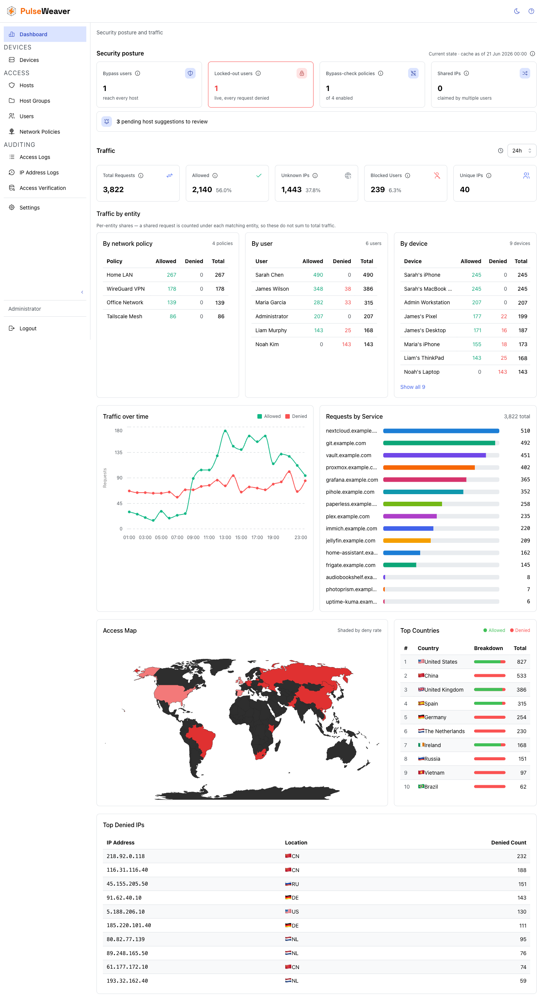
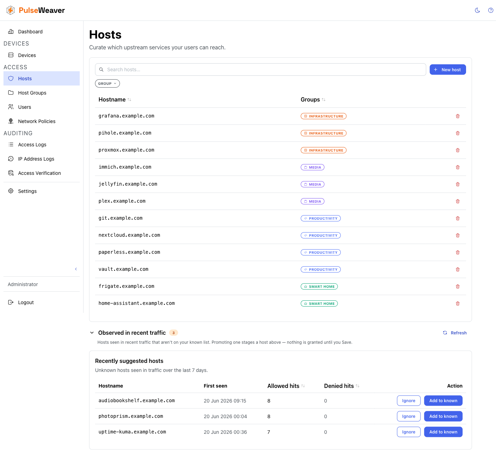
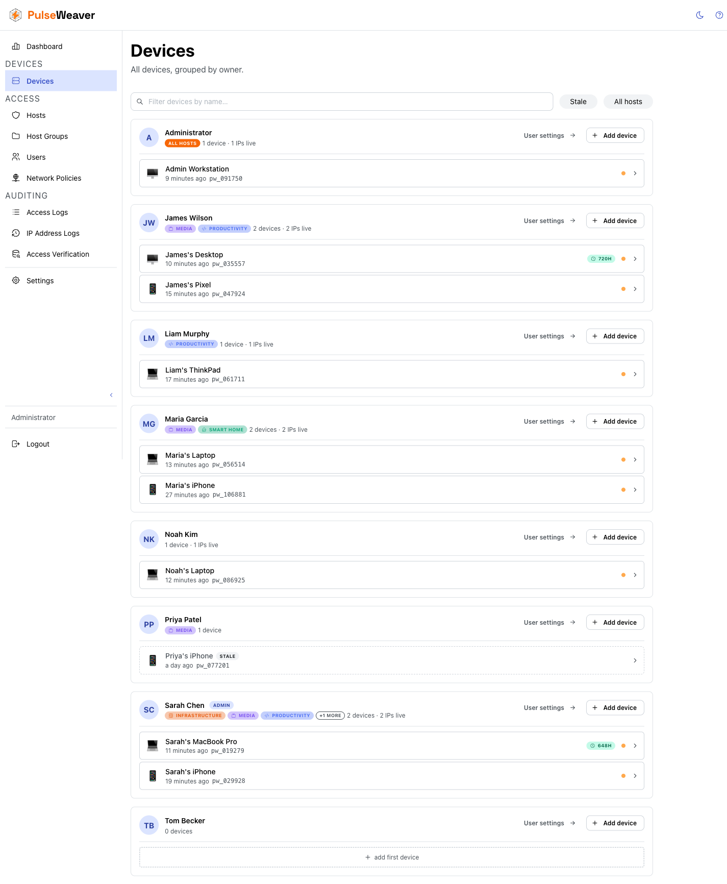
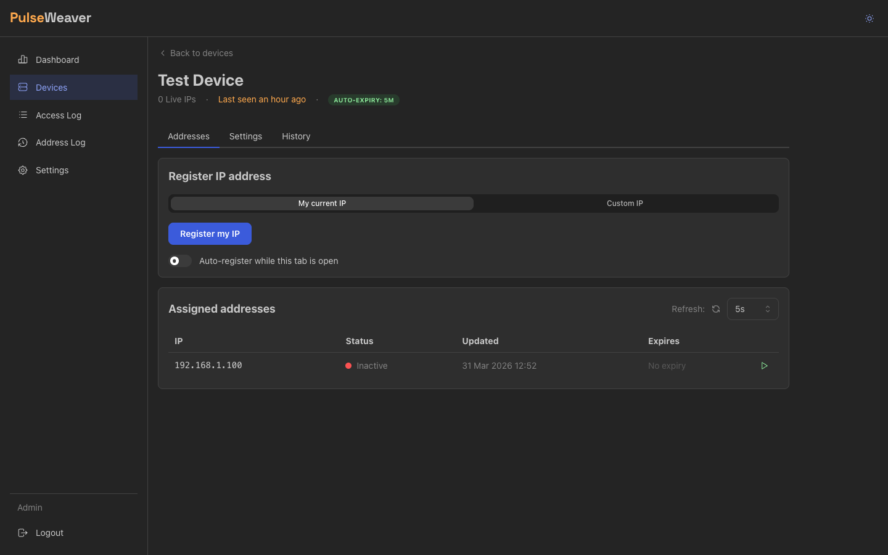

<picture>
  <source media="(prefers-color-scheme: dark)" srcset=".github/assets/wordmark-dark.svg">
  
</picture>

[](https://github.com/diegoguidaf/pulseweaver/actions/workflows/ci.yml)
[](https://github.com/diegoguidaf/pulseweaver/pkgs/container/pulseweaver)
[](go.mod)
[](LICENSE)

**PulseWeaver** is a self-hosted forward-auth gate for reverse proxies — per-user, IP-based access control over which
devices reach which services.

It keeps an up-to-date registry of your devices' current IP addresses and answers one question for your reverse proxy
on every incoming request: **may this client reach this host?** Each user gets an explicit allowlist of services;
everything else is denied. No config-file reloads, no static IP lists, and no identity provider bolted onto apps that
can't handle one.

A device registers its IP with a **heartbeat** — literally an authenticated `POST` whose *source IP* becomes the
allowlisted address. Phones and laptops on changing networks can keep that updated easily with provided tools ; a stable
server can just have its IP entered by hand. Shipped clients automate the heartbeat
(see [Heartbeat Client](https://github.com/DiegoGuidaF/pulseweaver-heartbeat-client), but nothing about it is special —
`curl` on a timer works just as well, as suggested in the heartbeat-client docs linked above.

This solution exists because I grew tired of the pain of trying to setup SSO and OAuth on a homelab where each service has
its own peculiarities and quirks (home assistant, jellyfin, nextcloud...). PulseWeaver is a **drop-in gate** with no
changes to the services themselves. Instead of changing how an application authenticates, PulseWeaver simply puts an IP
gateway in front of an application, and since this is always present no matter the request type, it is immediately compatible
with any type of service/request — HTTP, WebSocket, gRPC, etc. The whole thing is **one binary** with the web UI embedded and a single
SQLite file — no database server, no separate frontend to deploy.

> [!NOTE]
> PulseWeaver is not an authentication system. It is an **IP gate with per-user host authorization**: it never
> verifies *who* sends a request — it checks whether the request's IP belongs to a registered device (or trusted
> network range) and whether that device's owner is allowed to reach the requested host. Think of it as a
> network-layer bouncer with a guest list per door, not a login system.

---

## Features

- **Forward-auth gate** — your reverse proxy asks PulseWeaver on every request; answered from an in-memory cache, no
  per-request database work.
- **Heartbeat-tracked device IPs** — phones and laptops can keep their changing addresses registered automatically with a
  periodic POST; old addresses expire on their own when a device goes quiet or moves networks.
- **Per-user host access control** — deny-by-default grants over an admin-curated set of hosts, bundled into groups:
  "Tom can watch Jellyfin" is one checkbox. ([docs](docs/Host-Access-Control.md))
- **Per-device address rules** — an address lease (TTL) and a max-active-addresses cap keep each device's set of
  allowed IPs tight as it roams, with no manual cleanup. ([docs](docs/Connecting-Devices.md#recommended-settings-for-roaming-devices))
- **Network policies** — CIDR-range grants for networks you trust as a whole, like your LAN or a VPN subnet. ([docs](docs/Network-Policies.md))
- **Access logs & analytics** — every allow/deny decision recorded and filterable; dashboard with traffic over time,
  per-service splits, top denied IPs, and GeoIP enrichment. ([docs](docs/Observability.md))
- **Suggested hosts** — PulseWeaver proposes hostnames it sees in real traffic, so building the hosts list takes
  minutes, not an audit.
- **Device pairing** — one code (or QR scan) configures a device automatic heartbeat end-to-end, no manual URL/key entry.
- **Access verification** — ask "would IP X reach host Y?" and see exactly why, without sending real traffic.
- **Single binary** — embedded web UI, SQLite storage; one container, one volume, done.

---

## Screenshots

| Dashboard                                  | Host access control                                            |
|--------------------------------------------|----------------------------------------------------------------|
|  |  |

| Devices                                | Device addresses                                                |
|----------------------------------------|-----------------------------------------------------------------|
|  |  |

---

## How it works

Two flows work together. Your **reverse proxy** calls `GET /api/policy-engine/verify-ip` on every request, asking
*"may the client at this IP reach this host?"* — PulseWeaver answers 200 (allow) or 403 (deny) from an in-memory
cache. A request is allowed two ways: the IP is an active address of a registered device whose user is allowed that
host, or — **as a fallback, only when the IP belongs to no registered device** — the IP falls inside a
[network policy](docs/Network-Policies.md) range that allows it. Everything else, including known devices asking for
hosts their user was never granted, is denied.

Your **devices** keep their current IP registered by sending periodic heartbeats (`POST /api/v1/heartbeat` with an
`X-API-Key` header). Each heartbeat adds or refreshes an address;
per-device [address rules](docs/Connecting-Devices.md#recommended-settings-for-roaming-devices)
expire the stale ones so the allowed set stays tight as a device moves between networks.

📖 [Detailed flow diagrams →](docs/How-It-Works.md)

---

## Key concepts

| Concept            | Description                                                                                                                                                               |
|--------------------|---------------------------------------------------------------------------------------------------------------------------------------------------------------------------|
| **User**           | A person. Devices belong to users, and access is granted to users — "admin" is a role on a user, not a separate account type.                                             |
| **Device**         | A logical endpoint (phone, laptop, server…) with a unique API key, owned by a user.                                                                                       |
| **Address**        | An IP address (v4 or v6) linked to a device. A device holds a *list* of addresses, each enabled or disabled.                                                              |
| **Heartbeat**      | A device call to `/api/v1/heartbeat` that registers the caller's current IP as an active address of the device.                                                           |
| **Address lease**  | A per-device TTL\*. When no heartbeat refreshes an address before the TTL expires, PulseWeaver's background scheduler disables it.                                        |
| **Host**           | An admin-curated hostname that can be granted to users, e.g. `jellyfin.example.org`.                                                                                      |
| **Host group**     | A named bundle of hosts ("media", "storage"). **Groups are the only way hosts are granted** — you assign groups to users and to network policies, never individual hosts. |
| **Network policy** | A CIDR-range grant, used as a fallback for clients that are not registered devices — e.g. "the whole home LAN may reach these hosts."                                     |
| **Forward auth**   | The `GET /api/policy-engine/verify-ip` endpoint. Your reverse proxy calls this on every request.                                                                          |

> \***TTL**: Time-To-Live

---

## Quick start

Getting to a working setup is **three steps**:

1. **Deploy** PulseWeaver behind Caddy.
2. **Configure the server** — log in, add your hosts, bundle them into groups, grant users, create devices.
3. **Connect each device** so its IP stays registered.

When all three are done, every service behind your proxy is reachable only by the right people's devices. The rest of
this section walks each step; deeper material is linked out so this stays a quickstart.

### Step 1 — Deploy behind Caddy

The easiest way to run PulseWeaver is alongside Caddy with Docker Compose. Three values must agree so PulseWeaver can
tell which incoming connection is your proxy (and therefore read the *real* client IP from it, instead of seeing
Caddy's own address on every request):

- **`ipv4_address`** pins Caddy to a fixed IP on the shared Docker network.
- **`CADDY_IP`** in `.env` holds that same address.
- **`TRUSTED_PROXY`** in PulseWeaver's environment is set to `${CADDY_IP}`.

Why this matters in one line: a device behind a proxy never connects to PulseWeaver directly, so PulseWeaver has to be
told which peer is the proxy in order to trust the forwarded client IP. The full reasoning is in
[Understanding TRUSTED_PROXY](docs/Understanding-TRUSTED_PROXY.md). `POLICY_ENGINE_API_SECRET` is defined once in
`.env` and injected into both containers.

```yaml
# docker-compose.yml
name: proxy

services:
  caddy:
    image: caddy:2.11.1 # Example version, ensure you're running latest
    container_name: caddy
    restart: unless-stopped
    ports:
      - "80:80"
      - "443:443"
      - "443:443/udp"
    environment:
      PULSEWEAVER_POLICY_ENGINE_API_SECRET: ${PULSEWEAVER_POLICY_ENGINE_API_SECRET}
      TZ: ${TZ}
    volumes:
      - ./caddy/Caddyfile:/etc/caddy/Caddyfile
      - ./caddy/data:/data
      - ./caddy/config:/config
    networks:
      proxy:
        ipv4_address: ${CADDY_IP} # Fixed IP so we can wire it to PulseWeaver's TRUSTED_PROXY
    depends_on:
      - pulseweaver

  pulseweaver:
    image: ghcr.io/diegoguidaf/pulseweaver:latest
    container_name: pulseweaver
    restart: unless-stopped
    expose: # No need to use "ports" if you access this via Caddy
      - 8080
    environment:
      ADMIN_PASSWORD: ${PULSEWEAVER_ADMIN_PASSWORD}
      SERVER_PORT: 8080
      TRUSTED_PROXY: ${CADDY_IP}      # Caddy's container IP on the shared network (single IP only, no CIDR)
      POLICY_ENGINE_API_SECRET: ${PULSEWEAVER_POLICY_ENGINE_API_SECRET}
      TZ: ${TZ}
    volumes:
      - ./pulseweaver/data:/data   # Bind mount; ensure writable by non-root (chown 65532:65532) or use a named volume
    networks:
      - proxy

networks:
  proxy:
    driver: bridge
    ipam:
      config:
        # ⚠️ Example subnet only — NOT a recommendation. Pick a range that does not
        # collide with anything on your network, then update CADDY_IP to match.
        - subnet: 172.20.0.0/24
          gateway: 172.20.0.1
          ip_range: 172.20.0.128/25  # Restrict auto-assigned IPs to upper half so nothing claims Caddy's address
```

A minimal `.env` alongside it:

```dotenv
PULSEWEAVER_POLICY_ENGINE_API_SECRET=a-very-long-random-secret-at-least-16-chars
PULSEWEAVER_ADMIN_PASSWORD=a-strong-admin-password
CADDY_IP=172.20.0.2   # Must be inside the subnet above, in its lower half — keep it off the upper, auto-assigned range
TZ=Europe/Madrid
```

> [!TIP]
> Generate strong values for the two secrets with OpenSSL:
> ```bash
> openssl rand -base64 32   # PULSEWEAVER_POLICY_ENGINE_API_SECRET
> openssl rand -base64 24   # PULSEWEAVER_ADMIN_PASSWORD
> ```

> [!NOTE]
> The `172.20.0.0/24` subnet above is **an example, not advice** — copy-pasting it blindly is a common source of
> "works on the tutorial, breaks on my network" issues. `TRUSTED_PROXY` takes a single IP, not a CIDR range, and the
> compose file reserves the upper half of the subnet so nothing can accidentally claim Caddy's address. The full
> reasoning: [Understanding TRUSTED_PROXY](docs/Understanding-TRUSTED_PROXY.md#choosing-the-proxy-ip-in-docker-compose).

Then add the gate to any site you want to protect. The `forward_auth` block asks PulseWeaver before forwarding:

```caddy
your-service.example.com {
    forward_auth pulseweaver:8080 {
        uri /api/policy-engine/verify-ip
        header_up X-Real-IP {http.request.remote.host}
        header_up Authorization "Bearer {$PULSEWEAVER_POLICY_ENGINE_API_SECRET}"
    }
    reverse_proxy your-service:port
}
```

The endpoint is **fail-closed**: a missing header, wrong secret, unregistered IP, or a host the user was never granted
all return the same `403`. Protecting more than a service or two? Define the gate once as a reusable Caddy snippet
instead of pasting it everywhere — see the full guide.

📖 [Full Caddy setup guide →](docs/Caddy-Setup.md) — the recommended two-domain split (keep the admin UI off the public
internet), reusable snippets, device endpoints, and other proxy support.

### Step 2 — Configure the server

On first startup PulseWeaver bootstraps an `admin` user from the `ADMIN_PASSWORD` variable. Log in at your admin URL,
then set up access — admins think in *people and services*, so the UI does too:

1. **Add your hosts** under **Access → Hosts** — the hostnames you proxy (`jellyfin.example.org`, …). Once traffic
   flows, PulseWeaver suggests hosts it has actually seen, so you can promote them in a click.
2. **Bundle them into groups** under **Access → Host Groups** — *media*, *storage*, *home automation*. Groups are the
   unit access is granted in.
3. **Grant users** under **Access → Users** — assign each user the groups they should reach. Deny-by-default means a
   user reaches nothing until you do this.
4. **Create devices** under **Devices** — one per phone/laptop/server that needs access, each owned by a user.

📖 [Host Access Control →](docs/Host-Access-Control.md)

### Step 3 — Connect each device

A device gets access by keeping its current IP registered. The simplest path is **pairing**: create a pairing for the
device, and the user scans/pastes the code into the heartbeat client, which configures itself and starts heartbeating.
Devices with a stable IP can instead have their address entered by hand — no heartbeat needed.

The heartbeat and pairing endpoints must be reachable from devices **without** the forward-auth gate (a device on a new
network has to be able to register that network's IP). The [Caddy setup guide](docs/Caddy-Setup.md) shows the
recommended two-domain configuration that exposes only those two endpoints publicly.

📖 [Connecting devices →](docs/Connecting-Devices.md) — pairing, the heartbeat client, lightweight `curl`/systemd/launchd
setups, and the recommended lease settings for roaming.

### Configuration reference

| Variable                   | Required           | Default                    | Description                                                                                                                                                                                                                                                                                        |
|----------------------------|--------------------|----------------------------|----------------------------------------------------------------------------------------------------------------------------------------------------------------------------------------------------------------------------------------------------------------------------------------------------|
| `ADMIN_PASSWORD`           | Yes                | —                          | Password for the bootstrap `admin` account, applied **once** when that account is first created. Change it from the UI afterward; it is ignored on later startups.                                                                                                                                 |
| `POLICY_ENGINE_API_SECRET` | Yes (min 16 chars) | —                          | Shared secret that authenticates your proxy's calls to `verify-ip`, so only your proxy — not the public internet — can ask PulseWeaver for decisions. Minimum 16 characters; use a long random value.                                                                                              |
| `SERVER_PORT`              | No                 | `8080`                     | Port PulseWeaver listens on.                                                                                                                                                                                                                                                                       |
| `TRUSTED_PROXY`            | No (recommended)   | —                          | Single IP of your reverse proxy. Technically optional, but **set it in almost every deployment**: PulseWeaver is designed to run behind a trusted proxy, and without it the proxy's own IP can be mistaken for the client. See [Understanding TRUSTED_PROXY](docs/Understanding-TRUSTED_PROXY.md). |
| `RULE_CHECK_INTERVAL`      | No                 | `1m`                       | How often the background scheduler runs (lease expiry, rollups, retention). Set it at or below the lowest address-lease TTL you'll use.                                                                                                                                                            |
| `DATA_RETENTION_DAYS`      | No                 | `30`                       | Days to keep **per-request detail** — the access log and device address history. `0` disables pruning. Aggregated traffic is kept longer (see below), so old detail ages out without losing dashboard history. See [Observability](docs/Observability.md).                                         |
| `AGGREGATE_RETENTION_DAYS` | No                 | `365`                      | Days to keep the **hourly traffic aggregates** behind long dashboard windows. `0` = keep forever. Must be `0` or ≥ `DATA_RETENTION_DAYS`. See [Observability](docs/Observability.md).                                                                                                              |
| `GEOIP_ENABLED`            | No                 | `true`                     | Resolve client IPs to country/ASN for logs and dashboard. See [Observability](docs/Observability.md).                                                                                                                                                                                              |
| `DB_DIR`                   | No                 | `./data` (Docker: `/data`) | Directory for the SQLite database. See [Data Persistence](docs/Data-Persistence.md).                                                                                                                                                                                                               |
| `TZ`                       | No                 | `UTC`                      | Application timezone for explicit wall-clock operations. Persisted timestamps are UTC; API timestamps are serialized as UTC RFC3339.                                                                                                                                                               |
| `LOG_LEVEL`                | No                 | `info`                     | Log level: `debug`, `info`, `warn`, `error`.                                                                                                                                                                                                                                                       |
| `LOG_FORMAT`               | No                 | `text`                     | Log format: `text` (human-readable) or `json`.                                                                                                                                                                                                                                                     |
| `LOG_COLOR`                | No                 | `true`                     | Use coloured output for `text` format.                                                                                                                                                                                                                                                             |

---

## Device pairing

Pairing onboards a device onto a heartbeat client with no manual URL/key entry — an admin generates a code, the user
scans or pastes it, and the client configures itself.

1. Create the device under **Devices**, then create a **pairing** for it — choosing the heartbeat server URL, interval,
   biometric settings, and an expiry window.
2. PulseWeaver generates a single-use **pairing code** (an opaque string that encodes the server URL and a random
   token). Share it as a QR (rendered client-side in the browser) or copyable text.
3. The user pastes the code into the
   [Heartbeat Client](https://github.com/DiegoGuidaF/pulseweaver-heartbeat-client). The app decodes the server URL,
   calls the claim endpoint, and receives the device's full configuration — **including a freshly generated API key**.
4. The code is invalidated and the app starts heartbeating — no manual setup.

Pairing configures an **existing** device; it does not create one. The API key is generated at claim time and returned
exactly once — PulseWeaver only ever stores its hash. This separation means you can pre-configure a device before
pairing, and re-pair a device later (rotating its key) without recreating it. The code is retrievable by the admin
until claimed or expired.

> [!TIP]
> The heartbeat and pairing endpoints must be reachable by devices without the gate. Rather than exposing the whole
> admin UI, the recommended setup publishes **only those two endpoints** under a separate device domain (e.g.
> `pw-device.example.com`) and keeps the panel private. See the [Caddy setup guide](docs/Caddy-Setup.md) and
> [Connecting devices](docs/Connecting-Devices.md).

---

## Proxy integration

PulseWeaver works with any reverse proxy that supports forward auth — the integration requirements are the same
regardless of which proxy you use. Currently only **Caddy** has a tested and validated configuration. If you have a
working setup with nginx, Traefik, or another proxy,
[open an issue or PR](https://github.com/diegoguidaf/pulseweaver/issues) and community-validated configurations will be
added to the documentation.

📖 [Full Caddy setup guide →](docs/Caddy-Setup.md) · [Connecting devices →](docs/Connecting-Devices.md)

---

## Security model

PulseWeaver is an **IP gate with per-user host authorization** — it blocks unknown IPs before they reach any service,
and decides per user which hosts the known ones may reach. Who is behind a request is inferred from its IP, never
verified, so it complements rather than replaces app-level auth. When several users share one IP, only hosts that
**all** of them may reach are allowed — the strictest grant wins.

| ✅ Works well                                    | ⚠️ Not enough on its own                            |
|-------------------------------------------------|-----------------------------------------------------|
| Services that break behind SSO proxies          | Verifying *who* a user is (identity is IP-inferred) |
| Homelab with a small set of trusted networks    | Telling co-tenants apart on ISP-level CGNAT         |
| Reducing blast radius of unpatched CVEs         | A compromised active network                        |
| Zero-config travel access via heartbeat + lease | Replacing app-level authentication                  |

PulseWeaver should be **one layer** in a defence-in-depth strategy, not the only one.

📖 **Deep dives:** [Security Model](docs/Security-Model.md) · [Shared-IP Model](docs/Shared-IP-Model.md) ·
[Understanding TRUSTED_PROXY](docs/Understanding-TRUSTED_PROXY.md)

---

## Project status & support

PulseWeaver is in **beta**. The core gate, host access control, and observability surfaces are stable and in daily
use, but expect occasional rough edges and breaking changes before a 1.0 release. The project is developed with a
security- and performance-conscious eye — see [Testing & Validation](docs/Testing-and-Validation.md).

- 🐛 **Bug reports** → [GitHub Issues](https://github.com/diegoguidaf/pulseweaver/issues)
- 💬 **Questions & ideas** → [GitHub Discussions](https://github.com/diegoguidaf/pulseweaver/discussions)
- 🔀 **Working nginx / Traefik config?** Contributions are very welcome — see [Proxy integration](#proxy-integration).

---

## Development

PulseWeaver compiles to a **single binary** with the frontend SPA embedded. The frontend is built with Vite and
embedded at compile time — no separate web server needed in production.

### Quick start for local development

For local runs (no Docker), the app stores its database under `./data` relative to where you run it, and creates the
directory on first start — no root, no `/data` setup needed. Override with `DB_DIR` if you want it elsewhere.

```bash
# Backend (hot reload via Air)
make back-dev

# Frontend (Vite dev server, in a separate terminal)
make front-dev
```

### Useful make targets

Targets use a `back-*` / `front-*` prefix; run `make help` for the full list.

| Command           | Description                                                 |
|-------------------|-------------------------------------------------------------|
| `make build`      | Full production build → `bin/pulseweaver`                   |
| `make back-test`  | Run all Go tests                                            |
| `make back-lint`  | Format + lint                                               |
| `make front-lint` | ESLint + TypeScript type-check                              |
| `make check`      | Full validation: lint + type-check + tests (back + front)   |
| `make api`        | Regenerate backend + frontend types from `api/openapi.yaml` |

### Further reading

- [`CODEBASE-Backend.md`](CODEBASE-Backend.md) — backend package structure, domain boundaries, service lifecycle,
  observer pattern.
- [`CODEBASE-Frontend.md`](CODEBASE-Frontend.md) — frontend directory structure, routing, hook conventions, UX surfaces.
- [`CLAUDE.md`](CLAUDE.md) — full reference for AI-assisted development, conventions, and testing patterns.
- [`api/openapi.yaml`](api/openapi.yaml) — API schema; single source of truth for all endpoints and types.

### A note on AI usage

This project has not been vibe-coded. The author is a software developer with 9+ years of experience (primary stack:
Java/Kotlin). This is a first Go project and first React frontend. AI has been used extensively to accelerate tests and
frontend work, and as a learning tool — not as a replacement for understanding the code.
