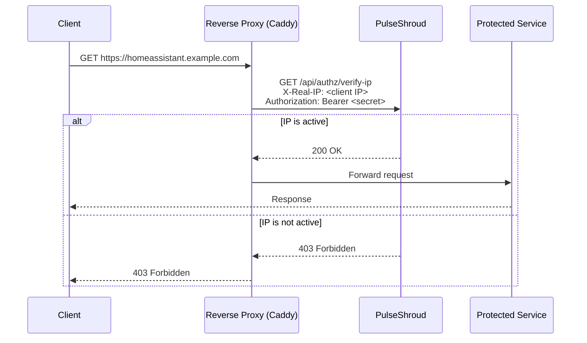
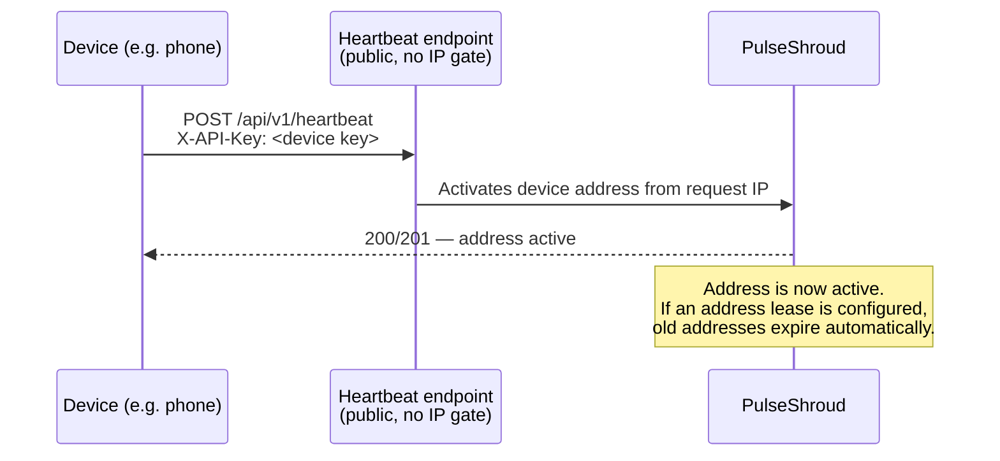

# PulseShroud

[](https://github.com/diegoguidaf/wallydex/actions/workflows/ci.yml)
[](https://github.com/diegoguidaf/wallydex/pkgs/container/wallydex)
[](go.mod)
[](LICENSE)

**PulseShroud** is a self-hosted device address tracker and forward-auth gate for reverse proxies.

It keeps an up-to-date registry of your devices' current IP addresses and tells your reverse proxy whether to allow or block each incoming request — no config file reloads, no static IP lists, and no complex identity providers required for the services you want to protect.

> [!NOTE]
> PulseShroud is not an authentication or authorization system. It is an **IP gate**. It does not verify who a user is; it only checks whether the IP a request comes from belongs to a registered device. Think of it as a network-layer bouncer, not a login system.

---

## Table of Contents

- [How it works](#how-it-works)
- [Why use this?](#why-use-this)
- [Key concepts](#key-concepts)
- [The shared-IP model](#the-shared-ip-model)
- [Setup](#setup)
  - [Docker Compose (recommended)](#docker-compose-recommended)
  - [First-run admin account](#first-run-admin-account)
  - [Configuration reference](#configuration-reference)
- [Proxy integration](#proxy-integration)
- [Heartbeat endpoint](#heartbeat-endpoint)
- [Security model](#security-model)
- [Development](#development)

---

## How it works

There are two independent flows:

### 1 — Forward Auth: every request is checked



Your reverse proxy asks PulseShroud on every incoming request: "is this IP currently active?" PulseShroud answers 200 (allow) or 403 (block). The check runs against an in-memory cache — no database round-trip per request.

### 2 — Heartbeat: devices keep their address current



Devices authenticate using a per-device API key (`X-API-Key` header). PulseShroud reads the client IP from the request (or from an `ip` field in the request body if provided) and activates it as the device's current address. As long as a device keeps sending heartbeats, its latest address stays active.

---

## Why use this?

Many self-hosted services — Home Assistant, Jellyfin, Nextcloud, Grafana, etc. — are not designed to work behind complex identity proxies like Authelia or authentik. Adding OIDC/SSO to them is often painful and sometimes breaks the app entirely.

PulseShroud takes a different approach: **only accept connections from IP addresses you know**. This drastically reduces the attack surface without touching how the application itself authenticates users.

A few concrete benefits:

- No OIDC configuration, no identity provider to maintain.
- Works with any service out of the box.
- Devices with changing IPs (phones, laptops on roaming) stay covered automatically via heartbeat.
- If you visit a friend or stay at a hotel, as soon as your phone connects to their Wi-Fi and sends a heartbeat, that location's IP is activated — and as soon as your address lease expires after you leave, it is automatically deactivated.

---

## Key concepts

| Concept           | Description                                                                                                                        |
|-------------------|------------------------------------------------------------------------------------------------------------------------------------|
| **Device**        | A logical endpoint (phone, laptop, server…) with a unique API key.                                                                 |
| **Address**       | An IP address (v4 or v6) linked to a device. Can be enabled or disabled.                                                           |
| **Heartbeat**     | A device call to `/api/v1/heartbeat` that enables the caller's current IP as the device's active address.                          |
| **Address lease** | A TTL* rule per device. When the TTL expires, the address is automatically disabled by PulseShroud's background scheduler.         |
| **Forward Auth**  | The `GET /api/authz/verify-ip` endpoint. Your reverse proxy calls this on every request to check the client IP.                    |

> **TTL**: Time-To-Live

---

## The shared-IP model

PulseShroud gates by IP, not by individual identity. This means:

- **Multiple devices behind the same NAT (e.g. a home router) all share one public IP.** If your phone's heartbeat activates your home IP, everyone at home can access your services. This is usually the intended behaviour.
- **Hotel Wi-Fi / friend's house:** as soon as your phone sends a heartbeat from a new network, that network's public IP is activated. Everyone else on that network can also access your services during your stay. If you have an address lease configured, the IP is automatically deactivated shortly after you leave — without any manual action.
- **ISP-level CGNAT:** some ISPs share a single public IP across hundreds or thousands of unrelated subscribers.
  Understand that activating a CGNAT IP means allowing all those co-tenants to reach your services. **If your device
  is behind CGNAT (check with your ISP), treat heartbeat-activated IPs from that network with caution.**

In summary: private NAT (home router, hotel, friend's house) — controlled network, great fit. ISP CGNAT — allows
multiple unknown co-tenants, higher attack surface.

---

## Setup

### Docker Compose (recommended)

The easiest way to run PulseShroud alongside Caddy. The key points are:

- Both services must be on the same Docker network so `wallydex:8080` resolves.
- `AUTHZ_API_SECRET` is defined once in your `.env` and injected into both containers.
- `TRUSTED_PROXY` must be set to Caddy's container IP so PulseShroud can correctly extract the real client IP on
  `/api/v1/heartbeat` calls. Caddy's `reverse_proxy` automatically adds `X-Forwarded-For`; PulseShroud only trusts that
  header when the request comes from the configured trusted proxy. For `/api/authz/verify-ip`, Caddy's `forward_auth`
  block sets `X-Real-IP` directly, so `TRUSTED_PROXY` is not strictly required for that endpoint.

```yaml
# docker-compose.yml
name: proxy

services:
  caddy:
    image: caddy:2.11.1 # Example version, ensure you're running latest
    container_name: caddy
    restart: unless-stopped
    ports:
      - "80:80"
      - "443:443"
      - "443:443/udp"
    environment:
      WALLYDEX_AUTHZ_API_SECRET: ${WALLYDEX_AUTHZ_API_SECRET}
      TZ: ${TZ}
    volumes:
      - ./caddy/Caddyfile:/etc/caddy/Caddyfile
      - ./caddy/data:/data
      - ./caddy/config:/config
    networks:
      proxy:
        ipv4_address: ${CADDY_IP} # Set specific IP so we can wire it to PulseShroud TRUSTED_PROXY
    depends_on:
      - wallydex

  wallydex:
    image: ghcr.io/diegoguidaf/wallydex:dev
    container_name: wallydex
    restart: unless-stopped
    expose: # No need to use "ports" if you access this via Caddy
      - 8080
    environment:
      ADMIN_PASSWORD: ${WALLYDEX_ADMIN_PASSWORD}
      SERVER_PORT: 8080
      DB_FILE: /app/data/wallydic.db
      TRUSTED_PROXY: ${CADDY_IP}      # Caddy's container IP on the shared network (single IP only, no CIDR)
      AUTHZ_API_SECRET: ${WALLYDEX_AUTHZ_API_SECRET}
      TZ: ${TZ}
    volumes:
      - ./wallydex/data:/app/data
    networks:
      - proxy

networks:
  proxy:
    driver: bridge
    ipam:
      config:
        - subnet: 172.20.0.0/24
```

A minimal `.env` alongside it:

```dotenv
WALLYDEX_AUTHZ_API_SECRET=a-very-long-random-secret-at-least-32-chars
WALLYDEX_ADMIN_PASSWORD=a-strong-admin-password
CADDY_IP=172.20.0.2   # Caddy's fixed IP on the proxy network (single IP, no CIDR)
TZ=Europe/Madrid
```

> [!TIP]
> Give Caddy a fixed `ipv4_address` on the shared docker network and set `TRUSTED_PROXY` to that exact IP.
> `TRUSTED_PROXY` accepts a **single IP address only** — CIDR ranges are not supported. Pinning Caddy's IP is the simplest
> way to keep this stable.

### First-run admin account

The PulseShroud web interface is password-protected. On first startup, PulseShroud automatically creates an `admin`
user using the password set in the `ADMIN_PASSWORD` environment variable. Use a strong, unique password and store it
securely (e.g. in your `.env` file with restricted permissions).

### Configuration reference

| Variable              | Required           | Default   | Description                                                                                                                          |
|-----------------------|--------------------|-----------|--------------------------------------------------------------------------------------------------------------------------------------|
| `ADMIN_PASSWORD`      | Yes                | —         | Password for the `admin` UI account (bootstrapped on first run).                                                                     |
| `AUTHZ_API_SECRET`    | Yes (min 32 chars) | —         | Shared secret between Caddy and PulseShroud. Minimum 32 characters.                                                                 |
| `SERVER_PORT`         | No                 | `8080`    | Port PulseShroud listens on.                                                                                                         |
| `TRUSTED_PROXY`       | No                 | —         | Single IP address of your reverse proxy. Required for heartbeat client IP extraction via `X-Forwarded-For`.                          |
| `DB_FILE`             | No                 | `data.db` | Path to the SQLite database file.                                                                                                    |
| `RULE_CHECK_INTERVAL` | No                 | `1m`      | How often the scheduler checks for expired address leases.<br/> Set this to the lowest address lease TTL you'll use.                 |
| `TZ`                  | No                 | `UTC`     | Timezone for timestamps.                                                                                                             |
| `LOG_LEVEL`           | No                 | `info`    | Log level: `debug`, `info`, `warn`, `error`.                                                                                         |
| `LOG_FORMAT`          | No                 | `text`    | Log format: `text` (human-readable) or `json`.                                                                                       |
| `LOG_COLOR`           | No                 | `true`    | Use coloured output for `text` format.                                                                                               |

---

## Proxy integration

### Caddy (forward_auth)

Add the `forward_auth` block to any site you want to protect:

```caddy
your-service.example.com {
    forward_auth http://wallydex:8080 {
        uri /api/authz/verify-ip
        header_up X-Real-IP {http.request.remote.host}
        # Pass the shared secret to prove Caddy is the caller
        header_up Authorization "Bearer {$WALLYDEX_AUTHZ_API_SECRET}"
    }

    reverse_proxy your-service:port
}
```

PulseShroud's verify-ip endpoint is **fail-closed**: any missing header, invalid secret, or inactive IP returns `403`.
It never returns `401` to avoid leaking information about why the request was rejected.

### Other reverse proxies

Any proxy that supports forward auth can work. The requirements are:

1. Call `GET http://wallydex:8080/api/authz/verify-ip` before forwarding the request.
2. Pass the real client IP in the `X-Real-IP` header.
3. Pass `Authorization: Bearer <AUTHZ_API_SECRET>` to authenticate the proxy-to-PulseShroud call.
4. Allow the request through on `200`; block on anything else.

---

## Heartbeat endpoint

The heartbeat endpoint (`POST /api/v1/heartbeat`) must be **reachable from your devices without going through the
forward-auth gate** — if it were gated behind the IP check, a device with a new IP could never activate that IP in the
first place.

### Exposing the heartbeat with Caddy

Create a dedicated site that routes only to the heartbeat endpoint:

```caddy
device-heartbeat.example.com {
    # Rewrite all requests to the heartbeat path
    rewrite * /api/v1/heartbeat

    # Proxy directly to PulseShroud, bypassing forward_auth
    reverse_proxy wallydex:8080
}
```

Authentication is handled by the device's `X-API-Key`, which PulseShroud validates for every heartbeat request. No
additional auth layer is needed.

**Optional extra obscurity:** If you want the endpoint to be harder to discover, you can add a random path segment to
the public URL and rewrite it:

```caddy
device-heartbeat.example.com {
    # Only accept requests to the secret path
    rewrite /your-random-secret /api/v1/heartbeat

    reverse_proxy wallydex:8080
}
```

The device API key remains the real security control. The path segment is just an additional obstacle.

### Android (Tasker)

Create a Tasker profile that triggers on:

- A periodic timer (e.g. every 4 minutes, take into account the address lease TTL for that device)
- WiFi connected / disconnected
- Mobile data connected / disconnected

The action is an HTTP Request (or a Shell action with `curl`):

```bash
curl -s -X POST https://device-heartbeat.example.com \
  -H "X-API-Key: your-device-api-key"
```

This keeps your phone's current IP active at all times as you move between networks.

**Recommended setup with address leases:**

Set your device's address lease TTL to **5 minutes** (a bit more than the heartbeat interval). This means:

- After each heartbeat, the address is active for 5 more minutes.
- If no heartbeat arrives (e.g. you turned off your phone), the address is automatically deactivated after 5 minutes.
- Old addresses (previous network) expire shortly after you change networks.
- The overlap window — the time two addresses are simultaneously active — is at most one heartbeat interval.

You can tune the TTL shorter (e.g. 2 minutes) for tighter expiry, or longer if you prefer more tolerance for missed
heartbeats.

### Laptop / static device

For a device with a mostly stable IP (e.g. a home laptop), manual management is usually sufficient:

1. Open the PulseShroud UI.
2. Navigate to your device's **Addresses** tab.
3. Click **Add address** and enter the IP manually.
4. Enable or disable addresses as needed.

No heartbeat automation required unless you want it.

### Future: CLI and mobile clients

A simple CLI tool (Linux, macOS, Windows) and native mobile helpers for iOS/Android are planned to make heartbeat setup
easier. Until then, `curl` + Tasker (Android) or a cron job is the recommended approach.

---

## Security model

### What PulseShroud is

An **IP gate**. It reduces the attack surface of your server by refusing connections from unknown IP addresses before
they reach any service. It is not:

- A user authentication system (no passwords, no sessions, no tokens for end users).
- A replacement for Authelia, authentik, Keycloak, or any identity provider.
- A guarantee of security on its own.

### When it works well

- Services that break when placed behind an SSO proxy (Home Assistant, many media servers, IoT dashboards, etc.).
- Homelab environments where the set of trusted networks is small and well-understood.
- Reducing the blast radius of unpatched CVEs: an attacker cannot even reach the service if their IP is not active.
- Travel and flexible remote access: heartbeat + address lease gives you zero-config access from wherever your device
  is.

### When it is not enough

- If you need to identify individual users (use app-level auth in addition).
- If clients are on ISP-level CGNAT (see above).
- If an active network is compromised (VPN leak, shared Wi-Fi with a bad actor, etc.).
- As a substitute for TLS. Always use HTTPS.

### IPv6

With IPv6, devices typically receive globally unique, non-NATted addresses. This means:

- Each device has its own public IP rather than sharing one with an entire household.
- The "shared NAT" behaviour described above does not apply — an IPv6 heartbeat will activate a specific device's
  address, not a whole network.
- This makes the IP gate more precise and, in principle, more secure under IPv6.

However, **IPv6 support in PulseShroud is not yet thoroughly tested**. The application handles IPv6 addresses in the
address model and normalises them at validation time, but real-world edge cases (prefix delegation, temporary addresses,
dual-stack setups) have not been fully exercised. Treat IPv6 as working but experimental until you have validated it in
your own setup.

### Pros and cons summary

**Pros**

- Drastically reduced attack surface — unknown IPs cannot even reach your services.
- Simple mental model: devices keep their address active, everything else is blocked.
- No changes to existing applications or their auth systems.
- Zero-config access from trusted locations via heartbeat + lease.
- The "whole-network" behaviour of NAT works in your favour for home, hotel, and friend's house scenarios.

**Cons / caveats**

- IP-based trust only — does not verify identity.
- CGNAT can expose your services to unrelated co-tenants if you are not careful.
- If an active network is compromised while the IP is active, the attacker gains access.
- Does not replace TLS or app-level authentication.
- PulseShroud should be **one layer** in a broader defence-in-depth strategy, not the only one.

---

## Development

PulseShroud compiles to a **single binary** with the frontend SPA embedded. The frontend is built with Vite and
embedded at compile time — no separate web server needed in production.

### Quick start for local development

```bash
# Backend (hot reload via Air)
make dev-back

# Frontend (Vite dev server, in a separate terminal)
make dev-front
```

### Useful make targets

| Command               | Description                                                 |
|-----------------------|-------------------------------------------------------------|
| `make build`          | Full production build → `bin/wallydic`                      |
| `make test`           | Run all Go tests                                            |
| `make lint`           | Format + lint                                               |
| `make api`            | Regenerate backend + frontend types from `api/openapi.yaml` |
| `make migrate-up`     | Apply pending database migrations                           |
| `make migrate-create` | Create a new migration pair                                 |

### Further reading

- [`CODEBASE-Backend.md`](CODEBASE-Backend.md) — backend package structure, domain boundaries, service lifecycle,
  observer pattern.
- [`CODEBASE-Frontend.md`](CODEBASE-Frontend.md) — frontend directory structure, routing, hook conventions, UX surfaces.
- [`CLAUDE.md`](CLAUDE.md) — full reference for AI-assisted development, conventions, and testing patterns.
- [`api/openapi.yaml`](api/openapi.yaml) — API schema; single source of truth for all endpoints and types.

### A note on AI usage

This project has not been vibe-coded. The author is a software developer with 9+ years of experience (primary stack:
Java/Kotlin). This is a first Go project and first React frontend. AI has been used extensively to accelerate tests and
frontend work, and as a learning tool — not as a replacement for understanding the code.
