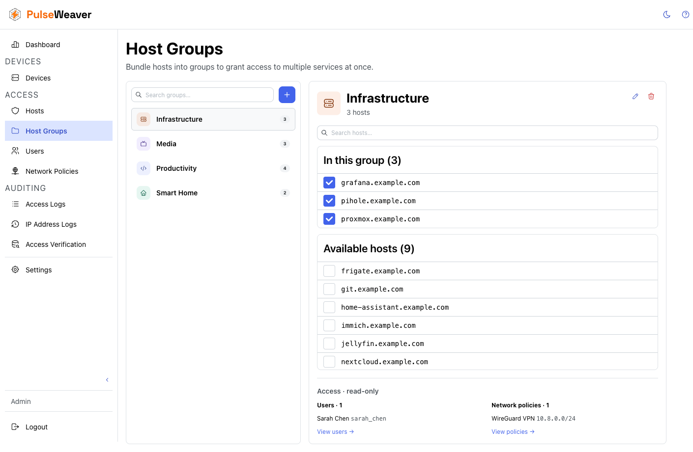
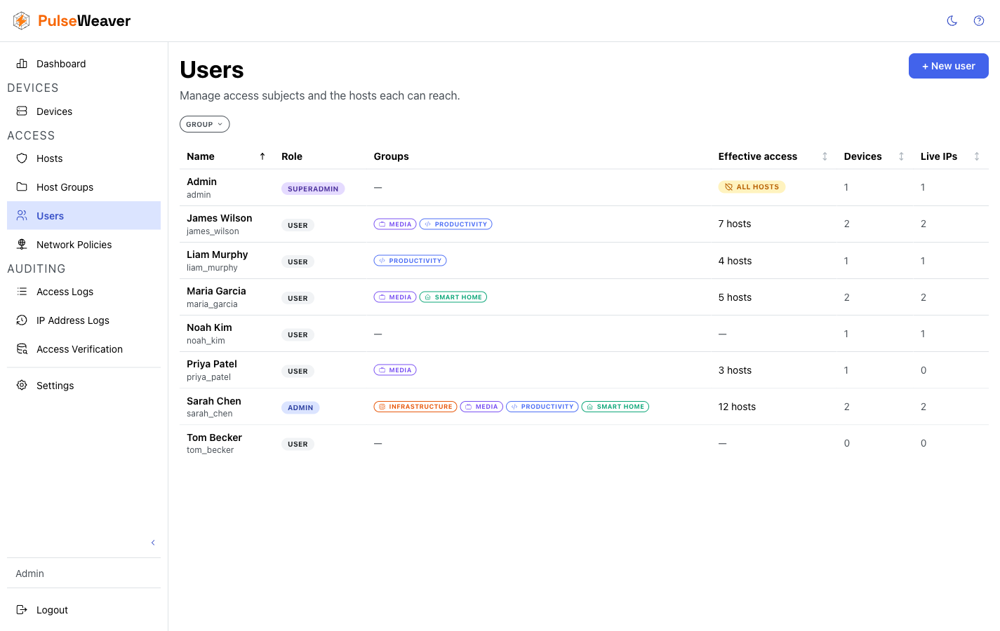

# Host Access Control

Host access control decides **which people can reach which services**. Instead of every registered device being able to
reach everything behind your reverse proxy, each user is granted a set of services — and anything not granted is
denied. "Mom can watch Jellyfin, but she can't open Nextcloud" is one checkbox, not a second auth system.

Access is **deny-by-default**: a new service added to your proxy is unreachable for everyone until you grant it. A new
user can reach nothing until you assign them something.

## Concepts

| Concept            | What it is                                                                                                            |
|--------------------|-----------------------------------------------------------------------------------------------------------------------|
| **Host**           | A hostname (FQDN) you have told PulseWeaver about, e.g. `jellyfin.example.org`. Only hosts you've added can be granted to anyone. |
| **Host group**     | A named bundle of hosts, e.g. *media* or *storage*. **Groups are the only way access is granted** — you assign *groups* to users (and to network policies), never individual hosts. Assign a group and the user reaches every host in it. |
| **Bypass host check** | A per-user switch that lets that user reach **any** host, skipping the grant check — convenient for an operator who should see everything. It is **off by default** and independent of role; turn it on deliberately per user. |
| **Suggested host** | A hostname PulseWeaver has seen in real traffic that you haven't added yet — offered as a shortcut when building your list. |

Hostnames are matched literally — no wildcards. `jellyfin.example.org` and `media.example.org` are two separate hosts
even if they point at the same service.

Because grants flow only through groups, **a host reaches no one until it belongs to a group, and a group reaches no one
until it's assigned to a user**. A host can live in several groups; a group can go to several users.

## Setting it up

1. **Build your hosts list** under **Access → Hosts**. Once traffic flows through PulseWeaver, the page suggests
   hostnames it has actually observed — promote the legitimate ones, ignore the noise (crawlers, typos, misconfigured
   clients). Ignored suggestions stay hidden until you un-ignore them.
2. **Organise hosts into groups** under **Access → Host Groups**. Group by who should get them together: *media*,
   *photos*, *home automation*. A host can belong to several groups.

   
3. **Grant access per user** under **Access → Users**. Assign each user the groups they should reach. That's it — their
   devices can now reach those hosts, and nothing else.

   

When you add a new service later: add it as a host, put it in the right group, and everyone with that group can
reach it. Nobody else can.

## How a request is decided

When your reverse proxy asks PulseWeaver about a request, the client IP identifies the device, the device identifies
its user, and the user's grants answer the question:

- The user has **bypass host check** on → allowed, regardless of host.
- The host is in one of the user's assigned groups → allowed.
- Otherwise → denied.

If an IP isn't any registered device, [network policies](Network-Policies.md) are consulted as a fallback. The full
request flow is in [How It Works](How-It-Works.md).

**Shared IPs: the strictest user wins.** When devices of several users sit behind the same IP (a family home, a shared
flat), PulseWeaver can't tell which person is making the request — so it only allows hosts that **all** of those users
are allowed to reach. One restricted user on a shared IP restricts the whole IP. See
[Shared-IP Model](Shared-IP-Model.md).

Changes to hosts, groups, or user grants take effect within milliseconds — the decision cache updates in place, no restart, no reload.

## What a denied request looks like

Every denial is the same plain **HTTP 403**, no matter the reason — unknown IP, unknown host, or a host the user simply
wasn't granted. The response never reveals whether the host exists, whether the user exists, or what they would need to
get in.

If you want unknown visitors to see nothing at all (no TLS handshake, no 403), that is a reverse-proxy and DNS
configuration concern — PulseWeaver's job ends at the allow/deny answer.

## Testing your configuration

Use **Auditing → Access Verification** to ask "would IP X reach host Y?" without sending real traffic. It shows the
decision and which grant (or missing grant) produced it — the safe way to check your setup after changes.

## What host access control is not

- **Not per-path or per-method** — grants cover a whole host, not URLs within it.
- **Not end-user self-service** — users can't see or request hosts; the admin is the only audience.
- **Not time-based** — a grant holds until you remove it.
- **Not authentication** — see the [Security Model](Security-Model.md) for what PulseWeaver does and doesn't verify.
