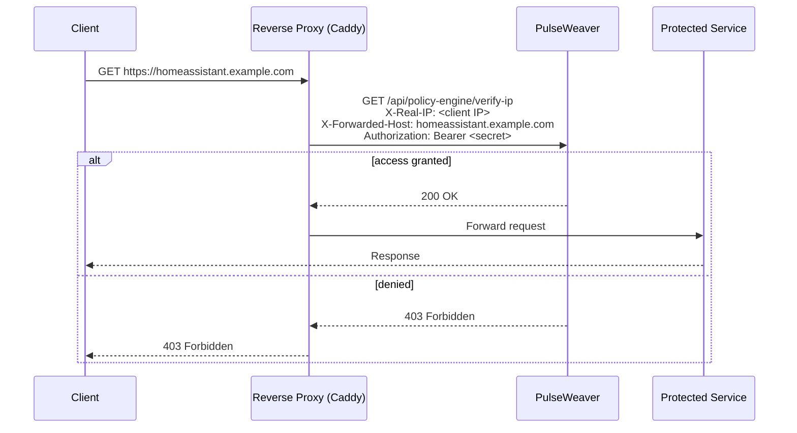
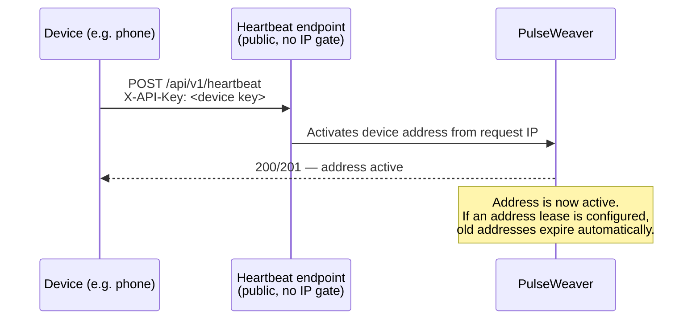
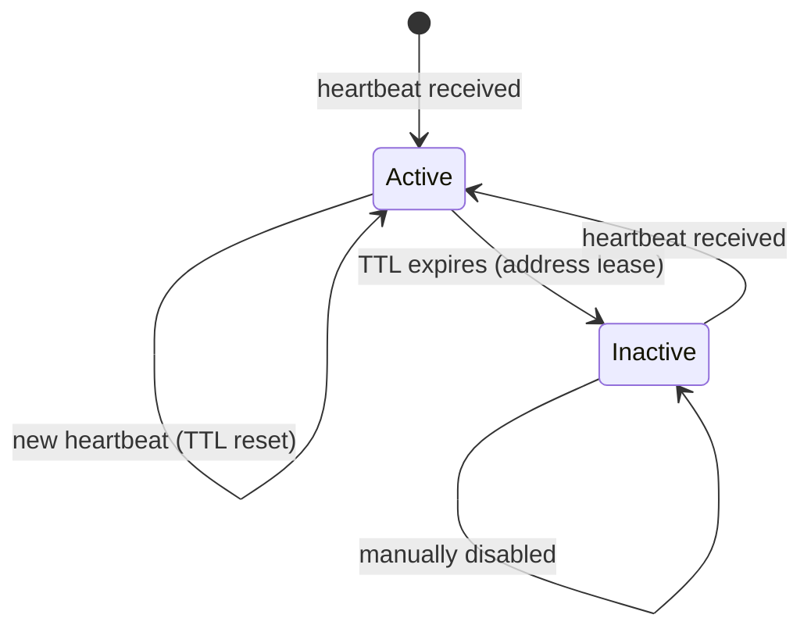

# How It Works

PulseWeaver has two independent flows that work together.

## 1 — Forward Auth: every request is checked

Your reverse proxy asks PulseWeaver on every incoming request: "may the client at this IP reach this host?" PulseWeaver answers 200 (allow) or 403 (deny). A request is allowed through one of two grant mechanisms:

1. The IP is an active address of a registered device, **and** the device's user is allowed to reach the requested host — see [Host Access Control](Host-Access-Control.md).
2. **As a fallback** — only when the IP is *not* a registered device address — the IP falls inside a [network policy](Network-Policies.md) range that allows the host.

Device addresses are checked first; network policies cover everything else. Everything not matched by either is denied — including active device IPs asking for a host their user was never granted. The check runs against an in-memory cache — no database round-trip per request.

## 2 — Heartbeat: devices keep their address current

Devices authenticate using a per-device API key (`X-API-Key` header). PulseWeaver reads the client IP from the request and registers it as one of the device's addresses. A device holds a **list** of addresses, not a single "current" one — each heartbeat simply adds a new IP or refreshes an existing one. Roaming between networks just adds more entries.

That list is kept tight by [address rules](Connecting-Devices.md#recommended-settings-for-roaming-devices): an **address lease** expires an address that stops being refreshed, and a **max-active-addresses** cap evicts the oldest. Without these, addresses would accumulate indefinitely.

An active address is the *identity* half of the decision — it ties the IP to a device and its user. Which hosts that user may then reach is governed by their [host access grants](Host-Access-Control.md).

## Address lease lifecycle

When a device has an **address lease** configured, PulseWeaver's background scheduler automatically disables addresses whose TTL has expired. So when a device stops refreshing an address — because it was switched off, *or* because it moved to a new network and is now heartbeating from a different IP — the stale address ages out on its own, without any manual cleanup. The new IP, meanwhile, was registered on the first heartbeat from the new network.
