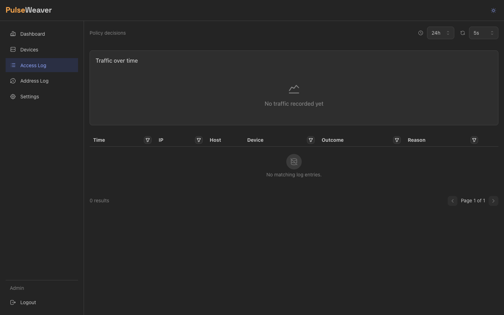
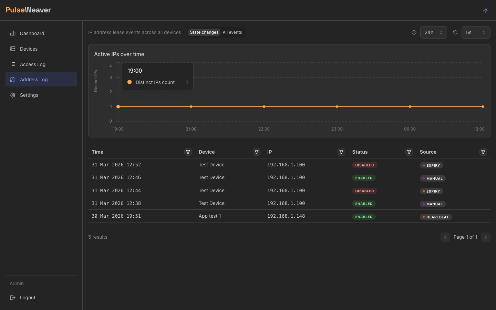

# Observability

PulseWeaver records every allow/deny decision it makes, so you can always answer "who reached what?" and "what is
getting blocked?" — at a glance on the dashboard, or per request in the access log.

## Access Logs

**Auditing → Access Logs** shows one entry per decision: timestamp, client IP, requested host, outcome, and — when
relevant — which device matched, which network policy matched, and where the IP is located.

Filter by any combination of client IP, outcome, deny reason, device, network policy, host, country, or continent.
Typical questions it answers:

- *What just got denied, and why?* Filter outcome = denied. The deny reason tells you whether the IP wasn't registered
  at all (`ip_not_registered`) or the user simply lacked a grant for that host (`host_not_allowed`).
- *What is this device actually reaching?* Filter by device.
- *Is anything from outside the country hitting my proxy?* Filter by country or continent.

### Performance and completeness

Logging is engineered to stay off the auth hot path. Each decision is handed to a buffered channel and written by a
background sink in batches, so recording a request never delays the allow/deny answer. This write path is profiled and
benchmarked (it's the busiest write in the system — every denied scan hits it).

Entries are **never sampled**: every decision that reaches the engine is recorded. The single exception is genuine
buffer saturation — if decisions arrive faster than the sink can drain for a sustained burst, the overflow is dropped
(and logged as such) rather than stalling request handling. In normal operation nothing is dropped; the only routine
remover of entries is the [retention policy](#data-retention).

### What never reaches the log

Two requests are rejected *before* a decision is made, so they produce no log entry:

- **QUIC 0-RTT early data** (`Early-Data: 1`) → `425 Too Early`. The client IP isn't reliable before the TLS handshake
  completes (RFC 8470), so the request is bounced to retry on an established connection.
- **A missing or empty `Authorization` header** → `403`. There's nothing to evaluate.

Note that a *wrong* secret (`invalid_token`) **is** logged — it reaches the engine and is recorded as a denial.
PulseWeaver does **not** rate-limit (it never returns `429`); throttling abusive clients is the reverse proxy's job.

## Dashboard

The **Dashboard** aggregates the same decisions into charts for a time window you pick (default: last 24 hours):

- **Traffic over time** — allowed vs denied request volume; the chart granularity adapts to the window, from per-minute
  for short windows up to per-day for multi-week ones.
- **Per-service split** — which hosts get the traffic.
- **Top denied IPs** — the addresses getting blocked most, a quick scan for scanners and misconfigured clients.

Windows up to 24 hours are computed live from the raw log. Longer windows use hourly summaries, so the most recent
hour fills in as it completes.

## GeoIP

Client IPs are resolved to **country, continent, and network operator (ASN)** so the access log and dashboard can show
and filter by geography. It works out of the box:

- Uses the free [DB-IP](https://db-ip.com) databases, downloaded automatically and refreshed monthly.
- Wholly self-contained — lookups happen locally; no per-request calls to any external service.
- Fail-open: if the data isn't available yet (or the IP is private), entries simply have no geo fields. GeoIP never
  blocks or fails a request.

| Setting          | Default        | Effect                          |
|------------------|----------------|---------------------------------|
| `GEOIP_ENABLED`  | `true`         | Master switch.                  |
| `GEOIP_DATA_DIR` | `./data/geoip` | Where the databases are stored. |

## Data retention

Old observability data is pruned by a daily-guarded background job. Crucially, retention prunes **detail, not history**:
the per-request rows age out, but the hourly aggregates behind the dashboard are kept far longer, so wide-window charts
still show traffic volumes long after the raw rows are gone.

| Setting                    | Default | Effect                                                                                                   |
|----------------------------|---------|----------------------------------------------------------------------------------------------------------|
| `DATA_RETENTION_DAYS`      | `30`    | Age cutoff for **raw detail** — individual `access_log` rows and device address-history entries. `0` disables raw pruning. |
| `AGGREGATE_RETENTION_DAYS` | `365`   | Age cutoff for the **hourly aggregates** that feed long dashboard windows. `0` = keep forever. Must be `0` or ≥ `DATA_RETENTION_DAYS`. |

`DATA_RETENTION_DAYS` covers both the access log and the device address history shown under **Auditing → IP Address
Logs** — one knob for both detail streams. So with the defaults, you keep 30 days of per-request rows you can filter and
inspect, and up to a year of aggregated traffic volume on the dashboard.

## Related

- How decisions are made: [How It Works](How-It-Works.md), [Host Access Control](Host-Access-Control.md),
  [Network Policies](Network-Policies.md).
- What the logs can and cannot tell you about *who* made a request: [Security Model](Security-Model.md).
